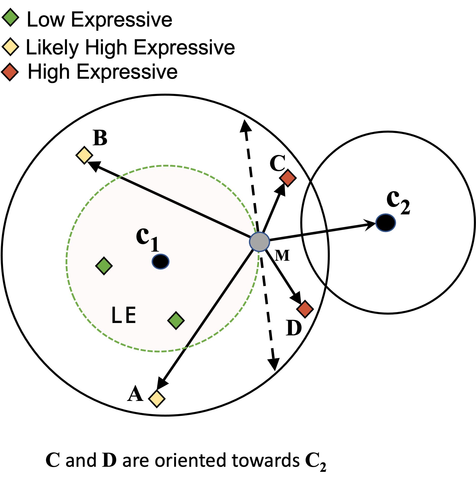

# Geometric-k-means

The concept is illustrated in Fig. 1. Instead of doing the traditional data agnostic iteration, __data is treated as a first class citizen to proactively channelize significant computations towards HE data__ (as opposed to LE and LHE). Our paper show that LE does not affect the convergence or quality of results. Our experiments revealed that, real world data contains susbtantial amount of *HE* points, resulting in significant saving of compute, training resources (memory) and time.   

<div align="center">
  
  </br>
</div>

**Figure 1: Illustrating _LHE_ and _HE_** $\mathbf{c_2}$ is the closest neighbor of $\mathbf{c}_1$, $\mathbf{M}$ denote the center of $\overline{\mathbf{c}_1\mathbf{c}_2}$. $\frac{1}{2}d(\mathbf{c}_1\mathbf{c}_2) = \mathbf{d}$. Distance between $\mathbf{c}_1$ and points $\mathbf{A, B, C, D}$ is $\mathbf{d}_1, \mathbf{d}_2, \mathbf{d}_3, \mathbf{d}_4$, respectively. Not all _LHE_ points qualify as _HE_. Only $C$ and $D$ are valid _HE_, because the angle subtended from $\overrightarrow{\rm M\mathbf{c}_2}$ to $\overrightarrow{\rm MC}$ and $\overrightarrow{\rm MD}$ is $< 90^{\circ}$. Conversely, _LHE_ points $A, B$ can be regarded as _LE_ because angle between vectors $\overrightarrow{\rm M\mathbf{c}_2}$ and $\overrightarrow{\rm M\mathbf{B}}$, $\overrightarrow{\rm M\mathbf{A}}$ is $> 90^{\circ}$.

### Read the papers

[Geometric-k-means Paper](https://arxiv.org/abs/2508.06353) 

[Data-Centric K-means paper]()

Please cite our work as follows. It helps us to keep contributing to the open-source community.

```
@article{sharma2025geometrickmeansboundfreeapproach,
      title={Geometric-k-means: A Bound Free Approach to Fast and Eco-Friendly k-means}, 
      author={Parichit Sharma and Marcin Stanislaw and Hasan Kurban and Oguzhan Kulekci and Mehmet Dalkilic},
      year={2025},
      eprint={2508.06353},
      archivePrefix={arXiv},
      primaryClass={cs.LG},
      url={https://arxiv.org/abs/2508.06353}, 
}
```


### Library overview

Implement and provide uniform access to the Geometric-k-means, and other fast k-means algorithms. Currently, the following algorithms are supported:

1. Lloyd's K-means
2. Elkan 
3. Hamelry 
4. Annulus 
5. Exponion 
6. Ball K-means++
7. Geo-Kmeans

We have tested the library with both real and simulated datasets. Sample datasets are bundled for demonstration:
- Breastcancer.csv
- CreditRisk.csv
- sensor.csv


### Python Bindings

Implementation of all the algorithms are also available as Python wrappers at the following Pip package.

[Python Wrapper](https://pypi.org/project/DataCentricKMeans/)


### Contact

*For any Bug Fixes/Feature Update(s), please contant*

Parichit Sharma: parishar@iu.edu


### Data Format

Input data should be present in a 2D matrix format, where rows are samples and column are the features. Please see the ```kmeans_wrapper.cpp``` for example usage of various function calls.
  

### Installation Instructions

The library contain header-files which can be directly included in the C++ source without explicit installation. For example, to call the ```geokmeans()```, include the following file:

```
#include "geokmeans.hpp"
```

**Dependencies** The library is written entirely in C++. There are no external dependencies. However, Ball-k-means depends on the Eigen header library, so if you plan to use it, then include the Eigen header files during compilation (see compilation instructions). We have already provided the eigen library folder in the repository.


### Compilation Instructions

```
g++ --std=c++17 -I"/path/to/eigen" kmeans_wrapper.cpp -o kmeans_wrapper
```

### How to use the library (Example: Working with the default bundled dataset) 

For demonstration purpose, users can run the `kmeans_wrapper` executable from the command line. Make sure that you have already compiled the binary from source (see *compilation instructions* above)


**1. _Change directory to src_**

```
cd src
```

**2. _Compile the binary_**

```
g++ --std=c++17 -I"/path/to/eigen" kmeans_wrapper.cpp -o kmeans_wrapper
```

**3. _Run_**
```
# Using random centroid initialization.
./kmeans_wrapper ../data/sensor.csv 10 0 100 random 12 output.csv

# Reading centroids from a file (when extracting centroids using k++ etc.)
./kmeans_wrapper ../data/sensor.csv 10 0.001 100 ../data/centroids.csv 12 output.csv
```

**4. _Individual Function Call_**

Each algorithm is accessible in the same uniform way by calling the relevant function. For details, see ```kmeans_wrapper.cpp```. For example, a standard function call for lloyd's kmeans is as follows:

```
result = lloyd_kmeans(dataset, num_clusters, threshold, num_iterations, numCols, init_type, seed);

# The returned values are stored in the structure res.
```

**5. _Probe the returned values_** 
```
result.loop_counter     # number of iterations on convergence
result.num_dists        # total number of distance calculations 
result.centroids        # Final centroids
```

### Related Work

Check out [Paper](https://datacentricai.org/neurips21/papers/145_CameraReady_Poster_DCAI_DataExpressiveness_2021.pdf) | [Paper](https://www.sciencedirect.com/science/article/pii/S2352711021001771) | [R Package](https://cran.r-project.org/web/packages/DCEM/vignettes/DCEM.html) | to learn more about previous work.

