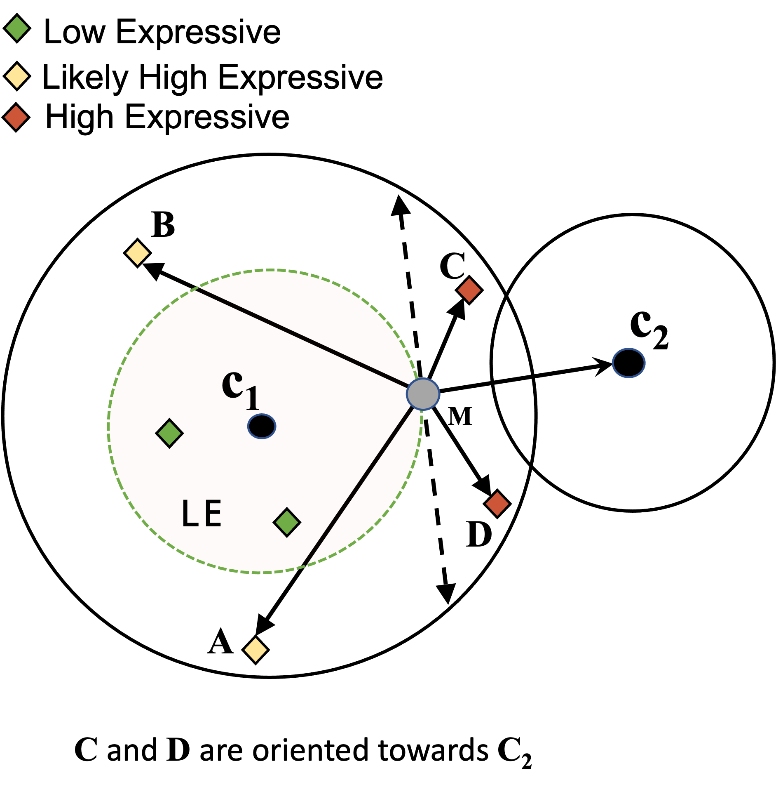

<!--
  README for https://github.com/parichit/Geometric-k-means
  Layout: Option A — C++ library at the repo root, R package in the `geokmeans/` subdirectory.

  NOTE ON FIGURES: the method figures below are hot-linked from the open-access
  paper on SpringerLink. If any does not render on GitHub, download it from the
  article and drop it into `images/`, then switch the  to a local path.

  NOTE ON CITATION: the second author is shown as "Marcin Malec" per the published
  Machine Learning article. If the correct spelling is "Marcin Stanislaw", update
  it in the BibTeX block and in the package DESCRIPTION/CITATION.
-->

<div align="center">

# Geometric-*k*-means

### A bound-free approach to fast and eco-friendly *k*-means


<br/>

[](https://doi.org/10.1007/s10994-025-06891-1)
[](https://CRAN.R-project.org/package=geokmeans)
[](https://www.gnu.org/licenses/gpl-3.0)
[](https://isocpp.org/)
[](https://www.r-project.org/)

**Same results as *k*-means. A fraction of the distance computations, memory, and energy.**

</div>

---

## Overview

**Geometric-*k*-means** (G*k*-means) accelerates the classic *k*-means algorithm by treating *data as a first-class citizen*. Instead of recomputing every point against every centroid each iteration, it uses simple **geometry — scalar projection — to focus computation only on the points that can actually change cluster membership** (the *high-expressive*, **HE**, points), and skips the rest (*low-expressive*, **LE**).

The payoff, established in the paper and reproducible from this repository:

- **Exact, not approximate** — provably converges to the *same* solution as Lloyd's *k*-means when initialized identically.
- **Far fewer distance computations** — up to **2–3 orders of magnitude** fewer than *k*-means on large data, with **98–99%** reductions reported, beating state-of-the-art bound-free (Ball *k*-means) and bounded (Exponion) methods.
- **Faster and leaner** — runtime speed-ups that grow with dataset size *m* and cluster count *k*, with a competitive memory footprint.
- **Greener** — a measurably smaller energy footprint, making it a more sustainable choice.

This repository provides both a **header-only C++ library** and an **R package** (`geokmeans`) that wraps it, so you get C++ speed from a one-line R call.

## The idea in one picture

A point only needs a distance computation if it is **oriented toward a neighboring centroid** (HE). Points oriented back toward their own centroid (LE/LHE) keep their membership and are skipped.

<div align="center">

<br/>
<sub><b>Only C and D are high-expressive (HE)</b> — the angle from the midpoint toward the neighbor centroid is &lt; 90°. A and B point back toward their own centroid and are treated as LE. <i>Figure from Sharma et al. (2026), Machine Learning (open access).</i></sub>
</div>

---

## The R package: `geokmeans`

Seven fast *k*-means variants behind one uniform interface — all the heavy lifting runs in C++ via [`Rcpp`](https://www.rcpp.org/) and [`RcppEigen`](https://cran.r-project.org/package=RcppEigen).

### Installation

```r
# From CRAN (once published)
install.packages("geokmeans")

# Development version from this repository (Option A: package lives in a subdirectory)
# install.packages("remotes")
remotes::install_github("parichit/Geometric-k-means", subdir = "geokmeans")
```

A C++17 compiler is required (the standard R toolchains on Windows, macOS, and Linux qualify).

### Quick start

```r
library(geokmeans)

set.seed(1)
X <- rbind(matrix(rnorm(200, mean = 0), ncol = 2),
           matrix(rnorm(200, mean = 6), ncol = 2))

# Geometric-k-means
fit <- geo_kmeans(X, centers = 2)

fit                 # iterations, distance computations, centroids
fit$cluster         # per-point cluster labels
fit$centroids       # final cluster centres

# Pick any algorithm by name
kmeans_dc(X, centers = 2, method = "elkan")

# Supply your own starting centroids (like stats::kmeans)
geo_kmeans(X, centers = X[c(1, 201), ])
```

Every function shares the same signature:

```r
geo_kmeans(data, centers,
           iter_max = 100, threshold = 1e-3,
           init = c("random", "sequential"),
           seed = 0, with_labels = TRUE,
           drop_empty = TRUE, verbose = FALSE)
```

`centers` is either the number of clusters *k* or a matrix of initial centroids. Random initialization uses R's RNG, so results are reproducible with `set.seed()` or the `seed` argument.

### Supported algorithms

| Function           | Algorithm                          | Type            |
|--------------------|------------------------------------|-----------------|
| `geo_kmeans()`     | **Geometric-*k*-means**            | bound-free      |
| `ball_kmeans()`    | Ball *k*-means++                   | bound-free      |
| `lloyd_kmeans()`   | Lloyd's *k*-means                  | baseline        |
| `elkan_kmeans()`   | Elkan                              | bounded         |
| `hamerly_kmeans()` | Hamerly                            | bounded         |
| `annulus_kmeans()` | Annulus                            | bounded         |
| `exponion_kmeans()`| Exponion                           | bounded         |
| `kmeans_dc()`      | dispatcher — choose via `method =` | —               |

### Example data

Two small datasets ship with the package:

```r
bc <- as.matrix(read.csv(
  system.file("extdata", "Breastcancer.csv", package = "geokmeans"),
  header = FALSE))

geo_kmeans(bc, centers = 2)
```

---

## The C++ library

The algorithms are header-only and can be included directly in your own C++ project (see the `src/` directory). For example:

```cpp
#include "geokmeans.h"
// output_data result = geokmeans(dataset, num_clusters, threshold,
//                                num_iterations, num_cols, "random", seed);
```

Ball *k*-means additionally uses [Eigen](https://eigen.tuxfamily.org/); the R package obtains Eigen through `RcppEigen`.

## Repository layout

```
Geometric-k-means/
├── src/            # header-only C++ implementations
├── data/           # datasets used in the paper
├── images/         # figures
└── geokmeans/      # the R package (CRAN)
```

---

## How to cite

If you use Geometric-*k*-means (the algorithm, the C++ code, or the R package) in your work, please cite the paper. It helps us keep contributing to the open-source community.

```bibtex
@article{Sharma2026Geometrickmeans,
  title   = {Geometric-k-means: A Bound Free Approach to Fast and Eco-Friendly k-means},
  author  = {Sharma, Parichit and Malec, Marcin and Kurban, Hasan and Kulekci, Oguzhan and Dalkilic, Mehmet},
  journal = {Machine Learning},
  year    = {2026},
  volume  = {115},
  number  = {2},
  pages   = {30},
  doi     = {10.1007/s10994-025-06891-1},
  url     = {https://doi.org/10.1007/s10994-025-06891-1}
}
```

> Sharma, P., Malec, M., Kurban, H., Kulekci, O., & Dalkilic, M. (2026).
> *Geometric-k-means: A Bound Free Approach to Fast and Eco-Friendly k-means.*
> Machine Learning, 115(2), article 30. https://doi.org/10.1007/s10994-025-06891-1

Read the paper: **[Machine Learning (Springer, open access)](https://doi.org/10.1007/s10994-025-06891-1)** · 

Preprint: **[arXiv:2508.06353](https://arxiv.org/abs/2508.06353)**

## License

Released under the **GPL-3** license. See [`LICENSE`](LICENSE).

<div align="center">
<sub>Built at the Luddy School of Informatics, Computing &amp; Engineering, Indiana University.</sub>
</div>
